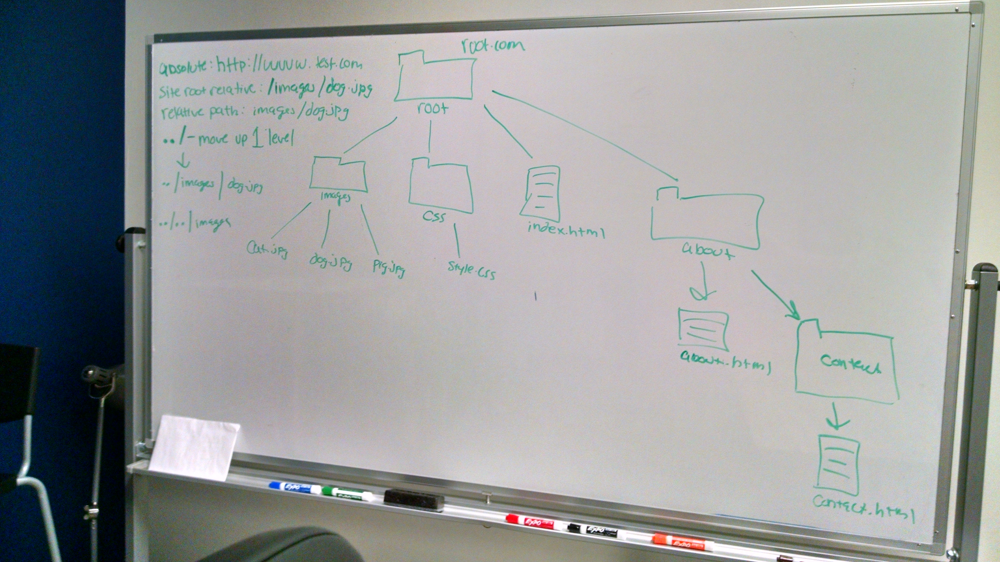

# 03/02/2016 - Day 3 - HTML Structural Elements and CSS Specificity

## Notes:
- Check-in on how HW went
- Debugging HW
- HTML Structural Elements
    + div
    + header
    + nav
        * nav structure
    + section
    + article
    + aside
    + footer
    + forms
- CSS Selectors/Specificity
    + Element
    + Descendent 
    + Parent/Direct Child (>)
    + General Siblings (~)
    + Direct Siblings (+)
    + Pseudo Classes
        * Hover
        * Active
        * Focus
        * Visited
    + Pseudo Elements
        * ::before
        * ::after
    + Universal Selectors
        * *
- Paths
    + Absolute
    + Site Root Relative
    + Document Relative
    + ../
- Box-Sizing: Border-Box
- Codepens from class:
    + [CSS Selectors](http://codepen.io/abbylarner/pen/qOWBWd)
    + [HTML5 Elements](http://codepen.io/abbylarner/pen/MaggPq)
    + [Positioning vs Margin and Alt Tag](http://codepen.io/abbylarner/pen/Qbeeed)
- [HTML entities](http://dev.w3.org/html5/html-author/charref)
- [TIY Breadcrumbs](http://tiy.breadcrumbsqa.com/)
- 